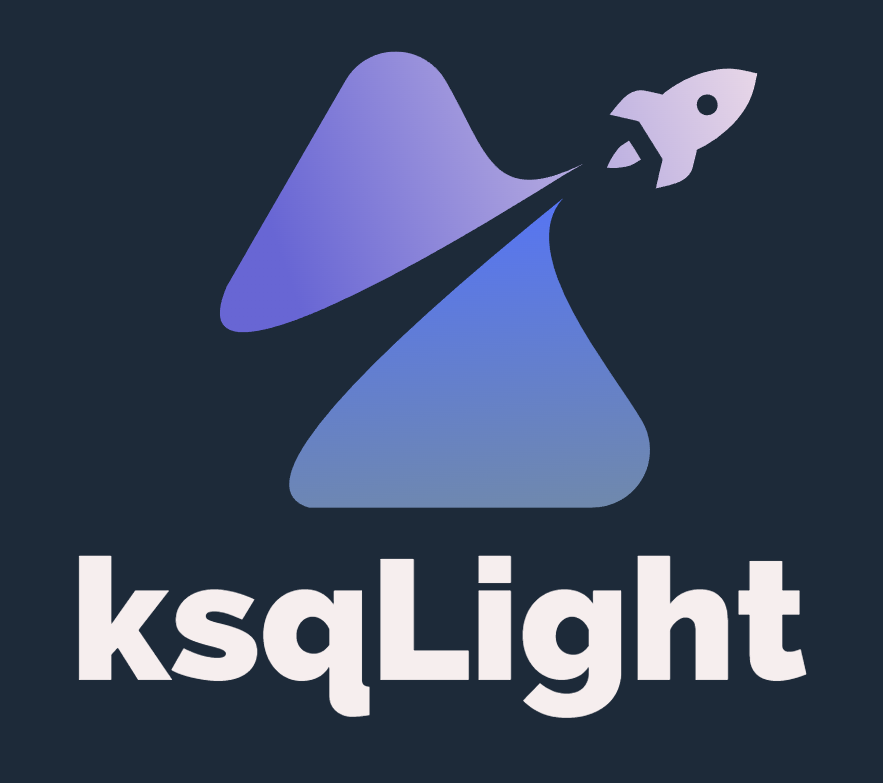

# ksqlSuite

<!-- 

 -->

   
 <strong>A suite of Node.js client and metric visualizer for ksqlDB</strong>

## About

Need to run stream processing workloads on ksqlDB in Node.JS? Our lightweight client can help. Check out [ksQlient](./ksqljs/)

Need to visualize ksqlDB query metrics to diagnose bottleneck issues? Try out our metric visualizer. Check out [ksqLight](./ksqLight/)
