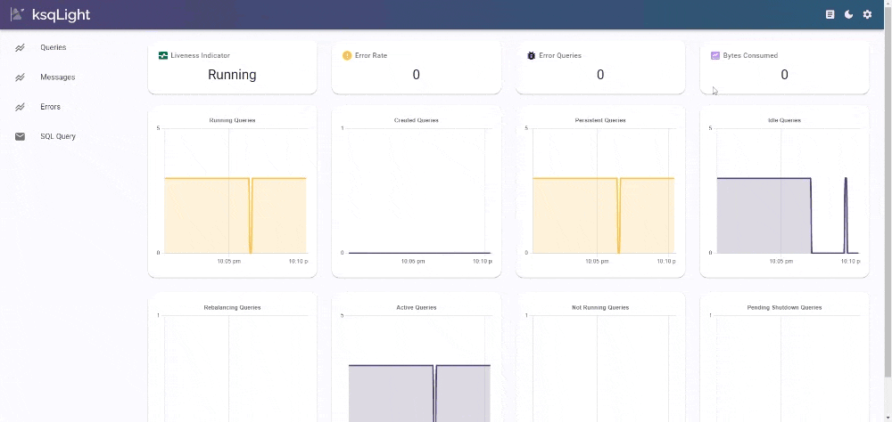
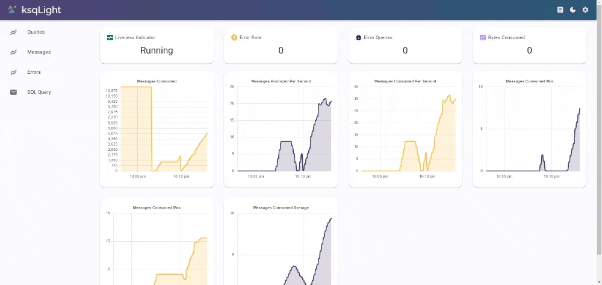

# ksqLight

# About

ksqLight is an open-source tool for monitoring your ksqlDB queries and messages in real-time. Its interactive dashboard visualizes ksqlDB query and messages metrics, to help in diagnosing stream processing bottlenecks and identifying network issues.

Under the hood, it uses Prometheus to pull the relevant metrics from ksqlDB server.

# Features

## Metrics

Quickly toggle between query, message, and error pages.

## Dark Mode

## Submit SQL queries to ksqlDB server (in progress)

# Setup

Upon startup, enter the Prometheus url into the pop-up (or you can enter it on the settings modal).

The duration and refresh rate for the time-series charts can be configured on the settings modal.

ksqlDB server url is needed to submit sql queries to the ksqlDB server.

# Developers

- Javan Ang - [GitHub](https://github.com/javanang) | [LinkedIn](https://www.linkedin.com/in/javanang/)
- Michael Snyder - [GitHub](https://github.com/MichaelCSnyder) | [LinkedIn](https://www.linkedin.com/in/michaelcharlessnyder/)
- Jonathan Luu - [GitHub](https://github.com/jonathanluu17) | [LinkedIn](https://www.linkedin.com/in/jonathanluu17/)
- Matthew Xing - [GitHub](https://github.com/matthewxing1) | [LinkedIn](https://www.linkedin.com/in/matthew-xing/)
- Gerry Bong - [GitHub](https://github.com/ggbong734) | [LinkedIn](https://www.linkedin.com/in/gerry-bong-71137420/)

# License

This product is licensed under the MIT License - see the LICENSE.md file for details.

This is an open source product.

This product is accelerated by OS Labs.

ksqlDB is licensed under the [Confluent Community License](https://github.com/confluentinc/ksql/blob/master/LICENSE).

_Apache, Apache Kafka, Kafka, and associated open source project names are trademarks of the [Apache Software Foundation](https://www.apache.org/)_.
